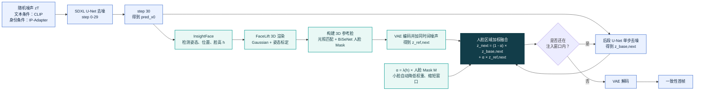
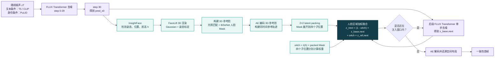

# 两种图像去噪路线

> 说明：两条路线本质上都属于扩散生成。这里按去噪主干分为传统 **U-Net Diffusion** 和 **DiT（Diffusion Transformer）**。

## 路线 A：U-Net Diffusion（SDXL + IP-Adapter）



计算上，人脸注入就是一次带 Mask 的加权融合：

```text
alpha  = lambda(h) * face_mask
z_next = z_base_next + alpha * (z_ref_next - z_base_next)
       = (1 - alpha) * z_base_next + alpha * z_ref_next
```

- Mask 外 `alpha = 0`：完全保留原生成结果。
- 人脸内部 `0 < alpha <= 0.4`：加入相应比例的 3D 参考脸 latent。
- 原始身份照片始终通过 IP-Adapter 提供全局身份条件。

## 路线 B：DiT（FLUX.1-dev + PuLID-FLUX）



DiT 路线使用同样的加权融合公式，区别是 FLUX 会把 `2×2` 个 VAE latent 位置打包成一个 token。因此 Mask 也拆成四个子位置权重：

```text
alpha_4ch = lambda(h) * packed_face_mask
z_next    = (1 - alpha_4ch) * z_base_next
          + alpha_4ch * z_ref_next
```

这样不是给整个 packed token 使用同一个权重，而是分别控制其中四个空间子位置，小脸边界会更精细。
